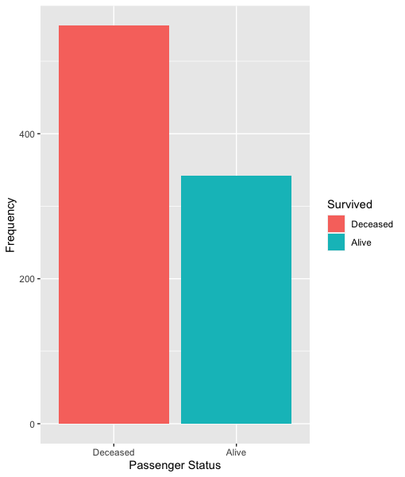
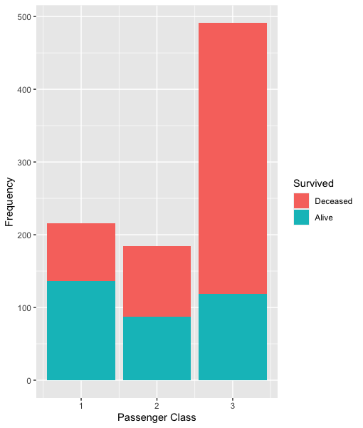
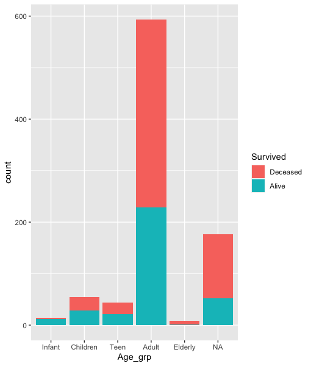

<!-- Heading -->
# **TITANIC**: Exploratory data analysis on Titanic survivor 

## **Background**
I want to make an analysis regarding the survivor from Titanic incident.
* the number of survivor based on passenger class.
* the number of survivor based on the age group.

## **Findings**
### The number of survivor and deceased generally.

### The number of survivor and deceased based on passenger class.

### The number of survivor and deceased based on age group.

## **Dataset**
https://www.kaggle.com/c/titanic/data 
